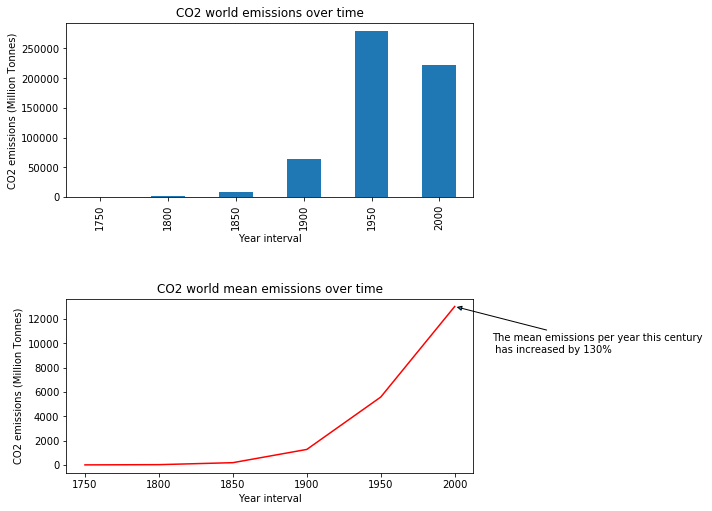
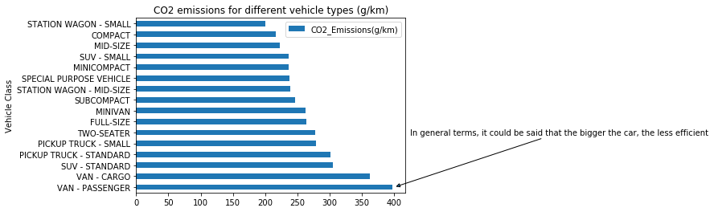
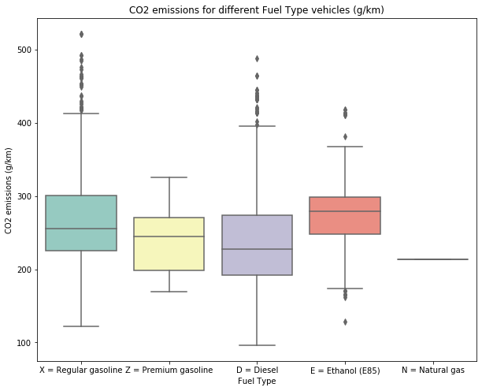
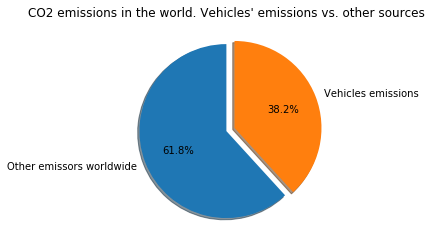

# CO2 emissions by fuel vehicles worldwide. Possibilities for electric vehicles-Bootcamp Fulltime de Data Anlytics de Ironhack's

## Resume

This is the project of a junior Data Analist in her earlies days at work. She has recently joined a electric components provider (TIER1) for electric vehicles, and one of the company's best clients is going to meet her next week to determine if the product is worthy or not.

The project consists of the manipulation, cleaning and analyzing of different datasets on CO2 emissions with Python, and the Storytelling of the data in order to convince that important client that it deserves to invest in the company and adquire electric components so as to transform vehicles.

## Resources
For this project, the following datasets have been used. Specially thanks to their contributors for spreading so rich information about this subject:

* **CO2 and GHG emission data**--> https://www.kaggle.com/srikantsahu/co2-and-ghg-emission-data

This dataset contains emission data of Green House Gases (in tonnes) of different countries from year 1750 - 2019.

* **CO2 Emission by Vehicles**--> https://www.kaggle.com/debajyotipodder/co2-emission-by-vehicles

This Dataset provide model-specific fuel consumption ratings and estimated carbon dioxide emissions for new light-duty vehicles for retail sale in Canada.

To help you compare vehicles from different model years, the fuel consumption ratings for 1995 to 2014 vehicles have been adjusted to reflect the improved testing that is more representative of everyday driving. Note that these are approximate values that were generated from the original ratings, not from vehicle testing.

* **Registered vehicles Data by country** --> https://apps.who.int/gho/data/node.main.A995 

This file from the Global Health Observatory data repository contains the total number of registered vehicles in the world (i.e. vehicles reported to a government agency and given some form of registration in each country).

## Structure

1) README.txt: As a resume for the content of the project an its development

2) data_cleaning.ipynb: Jupyer Notebook file that contains original data and its cleaning up

3) emissions_analysis.ipynb: Jupyer Notebook file that contains the main script for the Storytelling

4) self_choice.ipynb: Jupyer Notebook file that allows the client to take out different graphs and tables from the previously cleaned datasets

5) input: It contains the initial datasets, as mentioned before

6) src: It contains relevant files so that the code can be runned. These are .py files

7) output: It contains the extracted information from the code. For this project, graphs have been taken out

8) zz_trash: It contains dismissed analysis 

## Project development

First of all, the three dataset have been cleaned by means of outter functions in .py files. This job has been carried out in data_cleaning.ipynb

Afterwards, data has been interpret under a Storytelling sequence in emissions_analysis.ipynb

At last, a self_choice.ipynb has been developed in order to let the client analyze a piece of data by its own.

## Conclusions
- The emissions of CO2 have sharpy increased in the last century. We are far away from the zero emissions self-imposed by the European Union in 2050

The mean emissions per year this century have increased by 130%

-In general terms, it could be said that the bigger the car, the less efficient

-As it can be seen, the highest emissions are produced by Ethanol vehicles, where data is fairly concentrated

- **The mean CO2 emission for a vehicle is 250.58 g/km**

-Above all, for a penalty of 95€/ emitted CO2 gram per vehicle (the one that European Union will impose from 2022 on), the total penalty per year would ascend to **2380.51 Millions € for 100.000 cars sold in Europe**